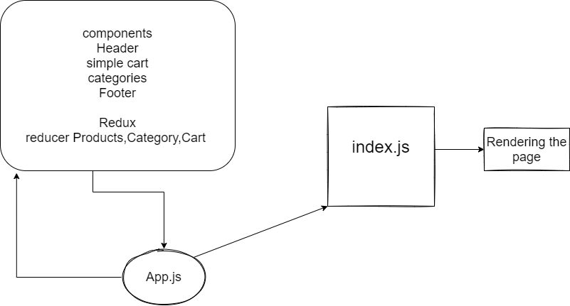

# Store Front
adding cart component 
make reducer for cart and prducts and category 
display simple cart 
increasing and decreasing stock
delete button for cart 
some Css

we will be adding the “Add to Cart” feature to our application, which will allow our users to not only browse items in the store, but also select them and have them persist in their “shopping cart” for later purchase.

# [netlify](https://60abcd05eedff73787c734cf--confident-dubinsky-ace6a5.netlify.app/)

uml

