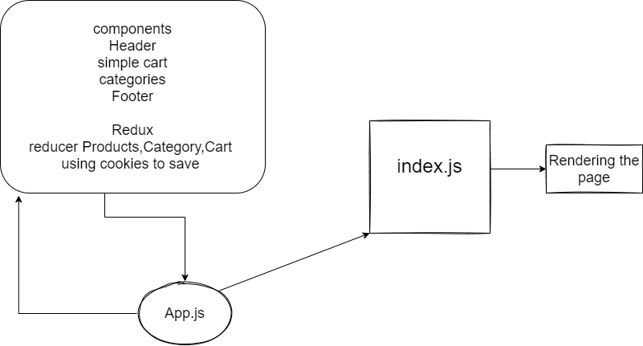

# Ak store 
using Live Inventory foR storing data and post data and update

using cookie to save what user added in cart and make a connnection between carts and the live inventory api 

# [netlify](https://60ae9c77f2ba5e00abbd2bcb--determined-bartik-a5043e.netlify.app/)

UML 

